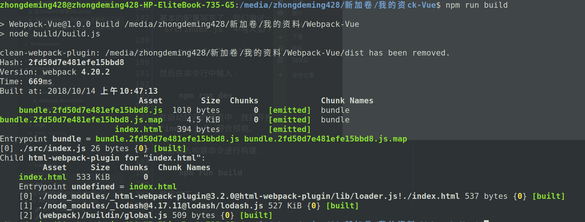

自从工作之后，就已经很久没有写过博客了。时间被分割得比较碎，积累了一段时间的学习成果，才写下了这篇博客。

之前有写过 Webpack4 的文章，但是都比较偏入门，唯一的一篇实战篇 —— [基于Webpack搭建React开发环境](https://juejin.im/post/5afc29fa6fb9a07ab379a2ae)，也是比较简单的，没有涉及到 CSS 抽取，第三方库打包等功能，这篇文章相对而言比较深入。但由于作者水平有限，难免存在谬误之处，欢迎大家指正。

还有没入门的童鞋可以参考我之前的文章：

  * [浅入浅出webpack](https://juejin.im/post/5afa9cd0f265da0b981b9af9)
  * [基于Webpack搭建React开发环境](https://juejin.im/post/5afc29fa6fb9a07ab379a2ae)

## 一、初始化项目

在命令行中敲入如下命令：

    mkdir Webpack-Vue && cd Webpack-Vue && npm init -y
  
然后你就可以在你的当前路径下看到一个叫 `Webpack-Vue` 的文件夹，里面有一个包含默认信息的 `package.json` 文件，打开并修改这个文件的一些内容。

然后我们在项目文件夹中创建以下几个文件夹：

  * dist
  * src、src/components
  * build

Linux 下可以输入一下命令进行快速创建：

    mkdir src src/components dist build -p

其中，dist 用于存放 Webpack 打包后的项目文件、src 用于存放你的源代码文件、build 用于存放 Webpack 打包相关的配置文件。

在 src 下，创建入口文件 `index.js`。

Linux 下创建的命令：

    touch ./src/index.js

在根目录下创建 `index.html` 文件，内容如下：

    <!DOCTYPE html>
    <html>
      <head>
        <title>Webpack Vue Demo</title>
        <meta http-equiv="Content-Type" content="text/html;charset=UTF-8">
        <meta name="viewport" content="width=device-width, initial-scale=1.0">
      </head>
      <body>
        

      </body>
    </html>

这将用于作为我们应用的模板，打包的 js 文件会在 Webpack 插件的处理下插入到这个文件中。

其他配置性文件根据你自己的喜好来添加了，比如 `.gitignore` 文件等。

## 二、安装 Webpack

要使用 `Webpack`，第一步当然是先安装。使用以下命令进行安装：

    npm i webpack webpack-cli -D

然后你就可以看到你的项目文件夹中多了一个 `node_modules` 文件夹，然后 `package.json` 文件中多了一个 `devDependencies` 属性。里面包含了安装的依赖名称和依赖版本，现在暂时还只有 `webpack` 和 `webpack-cli`。

## 三、配置最基本的 Webpack

这一节我们将着手配置一个具有最基本打包功能的项目，从 `src/index.js` 开始对项目进行打包。

为了项目结构更加科学合理，我们把所有的 Webpack 配置相关的文件都存放在了 `build` 目录中。

进入 `build` 文件夹，然后创建以下几个文件：

  * webpack.base.conf.js
  * webpack.dev.conf.js
  * webpack.prod.conf.js
  * build.js

在 Linux 中，可以敲入如下命令快速创建：

    cd build/ && touch webpack.base.conf.js webpack.dev.conf.js webpack.prod.conf.js build.js

其中，`webpack.base.conf.js` 是最基础的打包配置，是开发环境和生产环境都要用到的配置。`webpack.dev.conf.js` 就是在开发环境要使用的配置。`webpack.prod.conf.js` 就是在生产环境要使用的配置了。`build.js` 是通过 Node 接口进行打包的脚本。

接下来我们在对应的文件中写入最基本的配置信息。

### （1） webpack.base.conf.js

先写最基本的配置信息：

    const path = require('path');
    const HtmlWebpackPlugin = require('html-webpack-plugin');
    module.exports = {
      entry: {
        bundle: path.resolve(__dirname, '../src/index.js')
      },
      output: {
        path: path.resolve(__dirname, '../dist'),
        filename: '[name].[hash].js'
      },
      module: {
        rules: [
          
        ]
      },
      plugins: [
        new HtmlWebpackPlugin({
          template: path.resolve(__dirname, '../index.html')
        })
      ]
    };

### （2） webpack.dev.conf.js

同样写入最基本的配置信息：

    const merge = require('webpack-merge');
    const path = require('path');
    const baseConfig = require('./webpack.base.conf');
    module.exports = merge(baseConfig, {
      mode: 'development',
      devtool: 'inline-source-map',
      devServer: {
        contentBase: path.resolve(__dirname, '../dist'),
        open: true
      }
    });

### （3） webpack.prod.conf.js

继续写入最基础的配置：

    const merge = require('webpack-merge');
    const CleanWebpackPlugin = require('clean-webpack-plugin');
    const path = require('path');
    const baseConfig = require('./webpack.base.conf');
    module.exports = merge(baseConfig, {
      mode: 'production',
      devtool: 'source-map',
      module: {
        rules: []
      },
      plugins: [
        new CleanWebpackPlugin(['dist/'], {
          root: path.resolve(__dirname, '../'),
          verbose: true,
          dry: false
        })
      ]
    });

注意到我们上面引用了两个新的依赖，需要先进行安装才能使用：

    cnpm i webpack-merge clean-webpack-plugin webpack-dev-server html-webpack-plugin -D

### (4) build.js

这个脚本用于构建生产环境，开发环境基于 `webpack-dev-server` 搭建，不写脚本。

接下来，写入我们的打包脚本，通过 Node 调用 Webpack 进行打包。

    const webpack = require('webpack');
    const config = require('./webpack.prod.conf');

    webpack(config, (err, stats) => {
      if (err || stats.hasErrors()) {
        // 在这里处理错误
        console.error(err);
        return;
      }
      // 处理完成
      console.log(stats.toString({
        chunks: false,  // 使构建过程更静默无输出
        colors: true    // 在控制台展示颜色
      }));
    });

这样做的好处是可以利用 Node 做一些其他的事情，另外当 Webpack 配置文件不在项目文件夹根部时方便调用。

### （5） npm scripts

配置 npm scripts 能够使我们更方便的使用打包命令。

在 `package.json` 文件的 `scripts` 属性中，写入如下两条：

    "build": "node build/build.js",
    "dev": "webpack-dev-server --inline --progress --config build/webpack.dev.conf.js"

基本的配置写完了，我们测试一下打包效果，在 `src/index.js` 中写入如下代码：

    console.log('index.js!');

然后在命令行中输入：

    npm run dev

在自动打开的网页中，我打开控制台，我们可以看到输出了一句“index.js”，符合预期。

然后输入构建命令进行构建：

    npm run build

截图如下：

