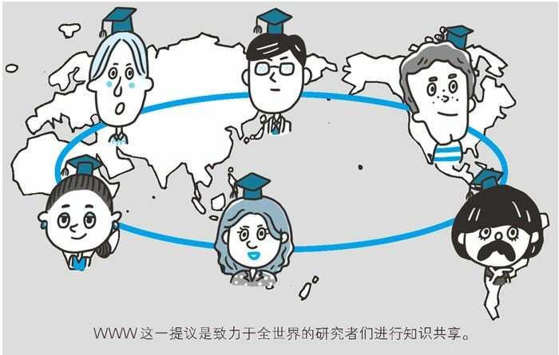
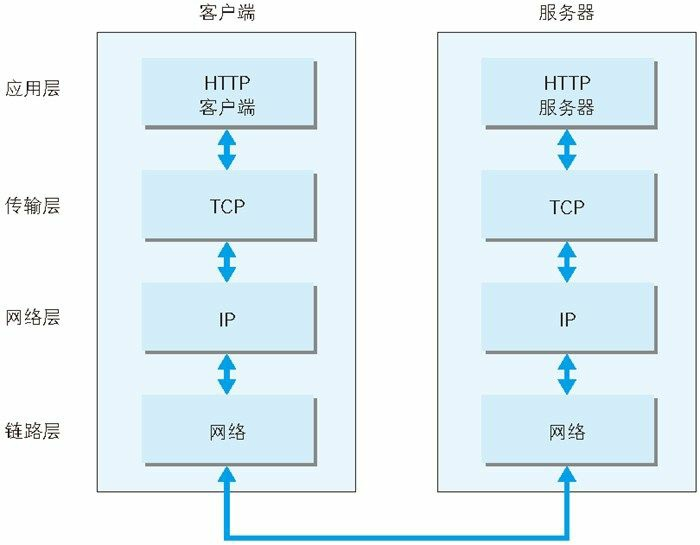

## 图解 HTTP 笔记（一）——了解 Web 及网络基础

> 本章内容：Web 建立在何种技术之上，HTTP 协议如何诞生并发展？

### 一、Web 基于 HTTP 通信

Web 使用一种名为 HTTP （HyperText Transfer Protocol，超文本传输协议）的协议作为规范，协议指的是对一些规则的约定。可以说 Web 是建立在 HTTP 协议上通信的。

### 二、HTTP 的诞生

#### 2.1 诞生背景

这一节主要讲 HTTP 的诞生背景，了解 HTTP 协议的诞生背景有利于我们学习理解 HTTP 协议。

HTTP 起初的诞生是为了知识共享，最初设想的基本理念是借助多文档之间的相互关联形成的超文本，连成可互相参阅的 WWW（World Wide Web，万维网）。

现在已经提出了三项构建技术：

* 把 SGML，即 `Standard Generalized Markup Language`(标准通用标记语言) 作为页面的文本标记语言的 HTML（HyperText Markup Language，超文本标记语言）；
* 作为文档传输协议的 HTTP；
* 指定文档所在地址的 URL（Uniform Resource Location，统一资源定位符）。

可以看出来上面三项分别构成了知识共享的内容（HTML）、知识共享的方式（HTTP 传输）和知识共享的位置。

#### 2.2 发展缓慢的 HTTP

**HTTP/0.9**

HTTP 诞生于 **1990** 年，此时还没有作为正式标准，此时的 HTTP 含有 HTTP/1.0 之前版本的意思，所以成为 HTTP/0.9。

**HTTP/1.0**

**1996 年 5 月**，HTTP 被正式作为标准，版本被命名为 HTTP/1.0。

**HTTP/1.1**

**1997 年 1 月**发布了 HTTP/1.1 版本，至今仍然是主流的 HTTP 协议。

由此可见，作为 Web 文档传输协议的 HTTP 协议版本更新十分缓慢，新一代的 HTTP 2.0 还在制定中，但是要大规模覆盖，还需要假以时日。

> [HTTP 2.0](<https://en.wikipedia.org/wiki/HTTP/2>)
>
> [HTTP/2.0 相比1.0有哪些重大改进？](<https://www.zhihu.com/question/34074946>)

HTTP 协议起初的诞生是为了解决文本传输的问题，现在已经超出了 Web 的界限，运用在许多场景。

#### 2.3 网络基础 TCP/IP

计算机之间要进行通信，需要基于相同的方法，比如如何探测目标、哪一边先发起通信、使用什么语言通信、什么时候结束通信等等。所有的这一切都需要事先约定好，所以约定的规则就被称为协议（protocol）。

一种说法认为 TCP/IP 指的是 TCP 和 IP 两种协议，另一种说法认为是指在 IP 协议通信的过程中所用到的协议族的同称，该书偏向于后一种说法。

#####  2.3.1 TCP/IP 的分层管理

TCP/IP 协议族最重要的一点就是分层管理，通常来说分为四层：应用层、传输层、网络层和数据链路层。

分层管理的最大好处就是将各个阶段的数据传输进行了隔离解耦，类似于编程时的模块化。处于某一层的应用只需要考虑该层所需要完成的任务，而不用管其他多余的事情。这样做使得各层协议的实现也变得自由了，要修改某一层的协议时，只需要修改该层的协议而不用涉及到其他层级的协议。

各层的作用如下：

* **应用层**，决定向用户提供应用服务时的通信活动。HTTP、FTP（File Transfer Protocol，文件传输协议）和 DNS（Domain Name System，域名解析系统）都属于该层。
* **传输层**，相对于上一层的应用层，该层提供处于网络连接中的两台计算机的数据传输。该层协议主要是 TCP（Transmission Control Protocol） 和 UDP（User Data Protocol）。
* **网络层**，用于处理网络上流动的数据包（数据传输的最小单位），该层规定了通过怎样的路径到达对方计算机，并把数据传送给对方。该层协议主要是 IP 协议和 ARP（Address Solution Protocol） 协议。
* **链路层**，用于处理网络连接的硬件部分，包括操作系统、设备驱动等，硬件上的范畴基本都在链路层的范围内。该层主要协议为以太网协议（Ethernet）。

> 关于网络分层的更多内容：<https://www.cnblogs.com/DM428/p/7029467.html>

##### 2.3.2 TCP/IP 通信传输流

利用 TCP/IP 通信时，会通过分层顺序与对方进行通信。发送方的数据流从上往下走，接收方的数据流从下往上走。

在传输过程的每一层中，都会对数据进行装箱和拆箱。发送方在发送数据时，在 HTTP 应用层会添加 HTTP 传输首部，在传输层会添加 TCP 传输首部，在链路层会添加以太网首部。接收方会在链路层收到传输的数据，然后从下层往上层开始拆箱。一层一层的去掉首部，最后剩下发送方最初发送的数据。到达应用层时就算真正接收到了客户端发送的数据了。

这种把数据信息包装起来的方法称为封装（encapsulate）。

##### 2.3.3 与 HTTP 关心密切的协议：IP、TCP 和 DNS

**IP 协议**

IP 协议负责网络传输，处于网络层。IP 不是 IP 地址，我们通常说的 IP 是一种协议。IP 地址指明了节点被分配到的地址，MAC 地址是网卡所属的固定地址，每块网卡出厂时，都有一个世界独一无二的MAC地址，长度是48个二进制位，用 12个十六进制位数表示。IP 地址可以和 MAC 地址配对，但是同一台机器 IP 地址可能会变，MAC 是固定不变的。

IP 间的通信依赖 MAC 地址，实际生活中同一局域网内的网络通信比较少，大部分都是广域网的通信，数据需要经过多个节点路由的转发才能到达目的地。而在中转时，会利用下一站中转设备的 MAC 地址来搜索下一个中转目标。这时会采用 ARP 协议（Address Resolution Protocol），根据对方的 IP 地址即可查出对应的 MAC 地址，但是两台设备必须在同一个子网内。

数据在网络中的传输类似于现实生活中的快递运输，中转设备就类似于物流中转中心。快递到达一个中转站之后，中转站会判断下一个中转站的地址然后继续进行派送，直到到达客户所在的中转站。

**TCP 协议**

TCP 位于传输层，提供可靠的字节流服务。

字节流服务（Byte Stream Service）是指为了传输方便，把大块的数据切割成以报文段（segment）为单位的数据包进行管理。TCP 的可靠之处在于它会确保数据被送到了接收方。

为了确保数据被准确无误地送到了接收方，TCP 采用了三次握手（three-way handshaking）的策略。握手过程中包含了两个重要的标志（flag）——SYN（synchronize）和 ACK（acknowledgement）。

发送端会先发送一个带有 SYN 的数据包给对方，接收端接收到数据之后返回一个 带有 SYN/ACK 标志的数据包给发送端，最后发送端再传回一个带有 ACK 标志的数据包表示“握手”结束。如果握手意外结束，那么 TCP 协议会再次以相同的顺序发送相同的数据包。

除了以上三次握手，TCP 还有其他方法确保可靠性。

**DNS**

DNS 也位于应用层，它提供域名解析服务。能够把域名解析为 IP 地址。

各种协议与 HTTP 之间的关系：

##### 2.3.4 URI 和 URL

URI（Uniform Resource Identifier，统一资源标识符）RFC2396 对名称中的三个单词做了解释：

* Uniform，规定统一的格式可方便处理不同的资源，而不用根据上下文环境来识别资源指定的访问方式，另外加入新的协议（http、ftp）也更容易。
* Resource，指任何可标识的东西。不仅限于文档、图片或服务。
* Identifier，表示可标识的对象，也称为标识符。

除了 HTTP 外，URI 还可以使用 mailto、ftp、telnet 等协议方案。

URI 用字符串标识某一互联网资源，而 URL 用字符串标识资源的地点。所以 URL 是 URI 的子集。

**URI 的格式**

其中：

* **登录信息（认证）**指定用户名密码作为从服务端获取资源时的登录信息，此项可选。
* **服务器地址**，可以是域名、IP。
* **服务器端口号**，指定服务器连接的网络端口号，此项可选，省略时用默认端口号。
* **带层次的文件路径**，指定服务器上资源的文件路径。
* **查询字符串**，通过查询字符串可以传入参数。
* **片段标识符**，指定已获取资源中的子资源（文档内的某个位置）。